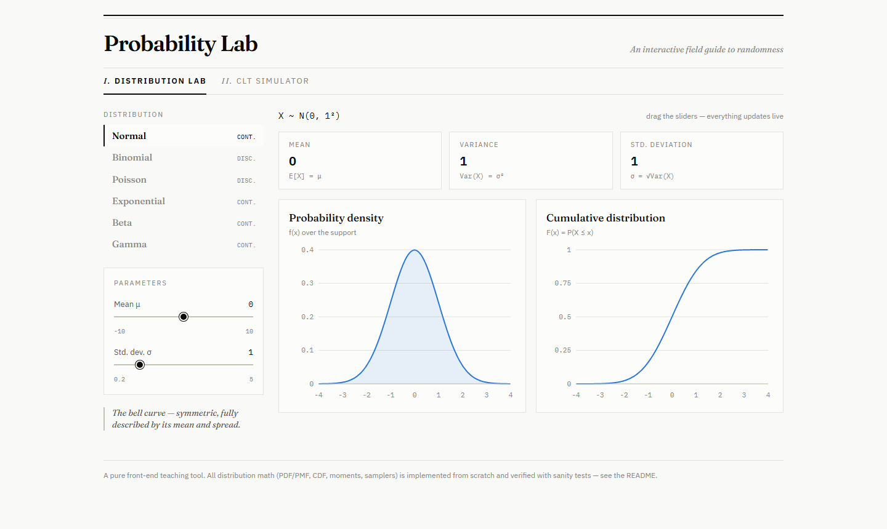
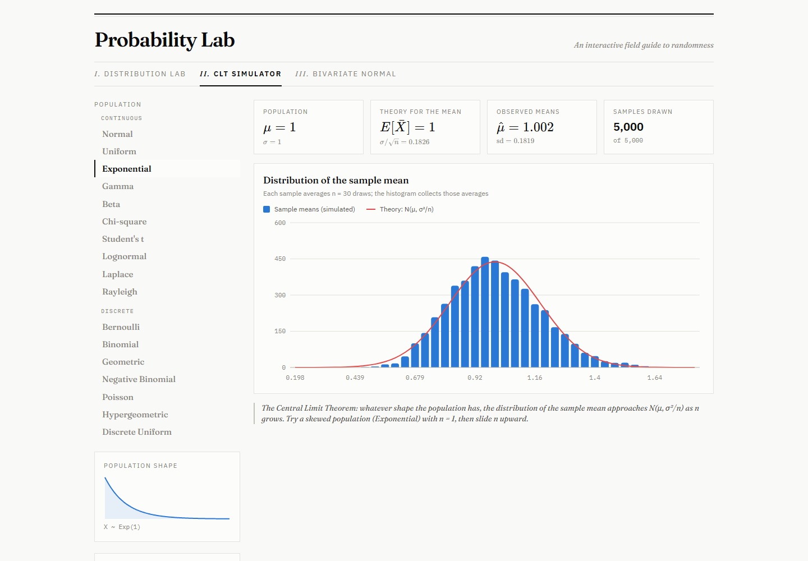
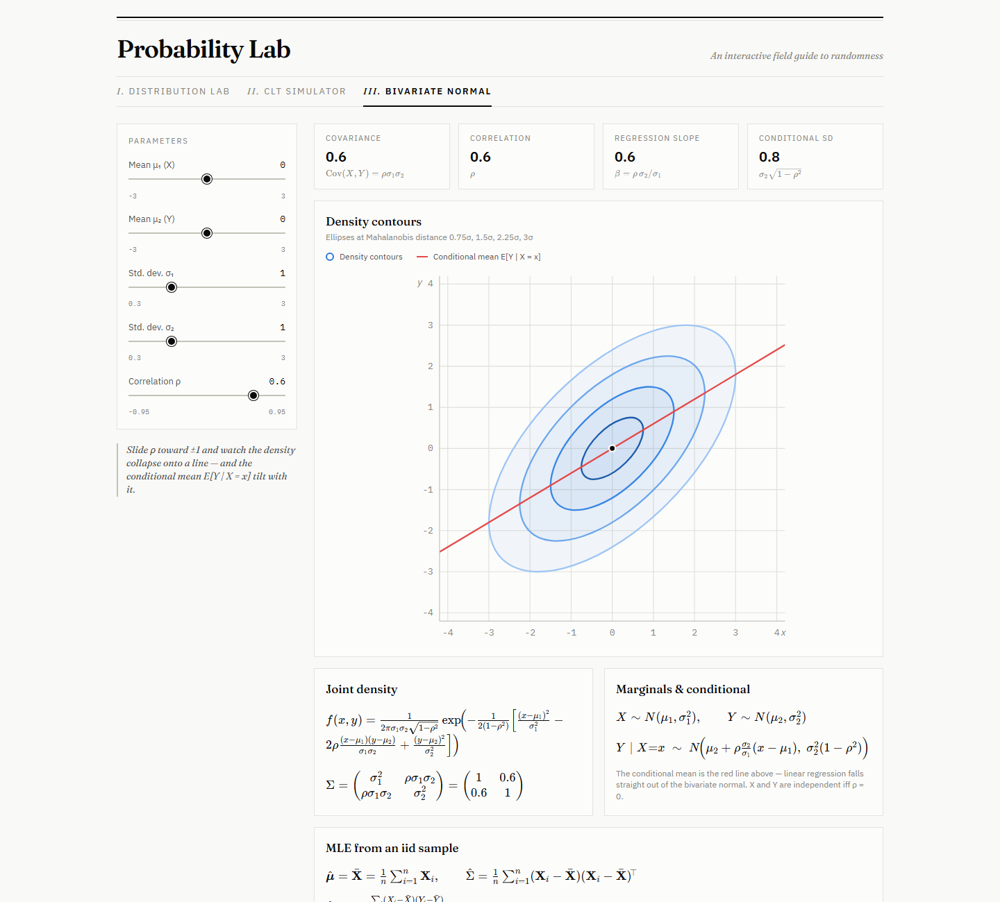

# Probability Lab

An interactive, pure front-end teaching tool for probability and statistics.
Drag sliders to see how distribution parameters shape the PDF/PMF and CDF,
read off the symbolic moments and estimators (MLE / method of moments) for
every distribution, watch the Central Limit Theorem emerge through animated
sampling, and explore the bivariate normal's geometry.

**Live demo:** <https://sfczaa.github.io/prob-stats-lab/>

## What's inside

### I. Distribution Lab

Explore **17 distributions** with live parameter sliders:

- *Continuous:* Normal, Uniform, Exponential, Gamma, Beta, Chi-square,
  Student's t, Lognormal, Laplace, Rayleigh
- *Discrete:* Bernoulli, Binomial, Geometric, Negative Binomial, Poisson,
  Hypergeometric, Discrete Uniform

The density/mass chart, the CDF chart, and the moment tiles all update as you
drag. Below the charts, a **Moments & estimators** panel shows — in proper
KaTeX-rendered math — the symbolic mean and variance plus the **maximum
likelihood** and **method-of-moments** estimators for an iid sample, including
the score equations (with a note) where no closed form exists (Gamma/Beta
shapes, t, Chi-square).



### II. CLT Simulator

Pick any of the 17 distributions as the population (including strongly skewed
ones like the Exponential or Geometric), choose the sample size *n* and the
number of samples, and run an animated simulation. Each sample averages *n*
fresh draws; the histogram of those sample means builds up in real time, with
the theoretical Normal curve N(μ, σ²/n) overlaid. Stat tiles compare the CLT
prediction with the observed mean/sd of the simulated sample means.



### III. Bivariate Normal

Density contour ellipses that tilt and stretch as you drag μ₁, μ₂, σ₁, σ₂ and
ρ, with the conditional mean E[Y | X = x] drawn as a regression line. Formula
cards show the joint density, the covariance matrix (symbolic and numeric),
the marginals, the conditional distribution, and the MLE of (μ, Σ, ρ) — the
MLE of ρ being exactly the sample correlation.



Tips:

- Set the CLT population to Exponential with n = 1 to see the raw skewed
  shape, then slide n upward and watch the bell curve take over.
- `#clt` / `#bivariate` in the URL deep-link to a section; adding `?autorun`
  starts a CLT run on page load (handy for sharing).

## Running locally

```bash
npm ci
npm run dev      # start the dev server
npm test         # run the math sanity tests
npm run build    # production build into dist/
```

## Deploying to GitHub Pages

`.github/workflows/deploy.yml` tests, builds, and publishes pushes to `main`.
GitHub Pages uses **GitHub Actions** as its source. The build uses relative
paths and requires no repository-specific base path.

## How the math works

No statistics library is used — all distribution math lives in `src/lib/` and
is implemented from scratch:

| Piece | Method |
|---|---|
| `log Γ(x)` | Lanczos approximation |
| Regularized incomplete gamma `P(a, x)` | series + continued fraction (Numerical Recipes) |
| Regularized incomplete beta `I_x(a, b)` | Lentz's continued fraction |
| Normal / Lognormal CDF, erf | via `P(1/2, x²)` |
| Binomial CDF | `I₁₋ₚ(m−k, k+1)` |
| Negative Binomial CDF | `I_p(r, k−r+1)` |
| Poisson CDF | `1 − P(k+1, λ)` |
| Chi-square CDF | `P(k/2, x/2)` |
| Student's t CDF | via `I_{ν/(ν+x²)}(ν/2, 1/2)` |
| Hypergeometric CDF | log-binomial-coefficient summation |
| Normal sampling | Box–Muller |
| Gamma / Chi-square / Beta / t sampling | Marsaglia–Tsang (+ `U^{1/a}` boost for shape < 1) |
| Poisson sampling | Knuth's product method |
| Geometric / NB / Exponential / Laplace / Rayleigh sampling | inverse transform |
| Hypergeometric sampling | sequential draws without replacement |

Estimator formulas (MLE and MME) are stored per distribution as KaTeX strings
and rendered in the Moments & estimators panel.

### Math tests

`npm test` runs **90 sanity tests** (Vitest) over the math core:

- **Hand-checked point values** — pdf/cdf values for all 17 distributions
  verified against textbook numbers (e.g. Φ(1.96) ≈ 0.975, t-table
  t₀.₉₅,₅ = 2.015, I₀.₅(3,3) = 0.5).
- **Self-consistency** — for every distribution, the density integrates/sums
  to ≈ 1 over the plotted range, its numeric moments match the closed-form
  mean/variance formulas, and the CDF matches the integrated density. This
  catches parameterization mistakes (rate vs. scale) by construction.
  (The heavy-tailed t and Lognormal skip the slow-converging numeric second
  moment — their variance is verified by the sampler test instead.)
- **Sampler checks** — 40,000 seeded draws per distribution must reproduce the
  theoretical mean and variance within tight tolerances, so the CLT simulator
  is fed by verified samplers.

## Tech stack

- **React 19 + Vite** — SPA, no backend
- **Recharts** — charts (plus a hand-rolled SVG contour plot for the
  bivariate normal)
- **KaTeX** — math rendering
- **Tailwind CSS v4** — styling
- **Vitest** — math sanity tests
- Typography: Fraunces + IBM Plex Sans/Mono, bundled locally through Fontsource

The app runs calculations in the browser and does not add analytics or send
simulation inputs to an application server. Fonts load from the same site;
GitHub Pages still handles ordinary hosting requests.

## Project structure

```
src/
  lib/
    special.js            # logGamma, incomplete gamma/beta, erf
    dists-continuous.js   # 10 continuous distributions (+ formulas)
    dists-discrete.js     # 7 discrete distributions (+ formulas)
    distributions.js      # registry, plotting helpers, param clamping
    random.js             # seedable PRNG (mulberry32), Box–Muller, Marsaglia–Tsang
    format.js             # number formatting, nice axis ticks
    *.test.js             # sanity tests
  components/
    DistributionLab.jsx   # section I
    CLTSimulator.jsx      # section II
    BivariateNormal.jsx   # section III (SVG contours)
    EstimationPanel.jsx   # symbolic moments + MLE/MME
    TeX.jsx               # KaTeX wrapper
    ...                   # chart cards, sliders, tiles, shared chart theme
```

Not included (by design): the Multinomial distribution is multivariate — its
outcome is a vector, so it doesn't fit the single-axis PDF/CDF and CLT
framework here (its k = 2 case is exactly the Binomial).
